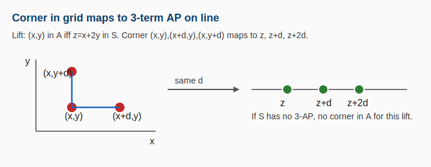
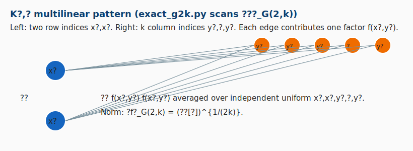
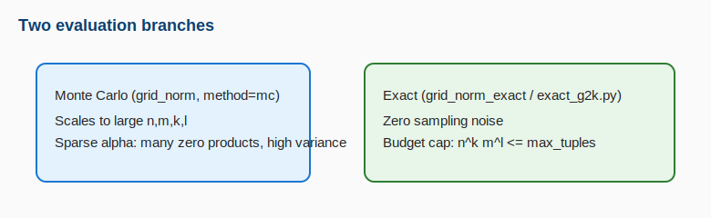
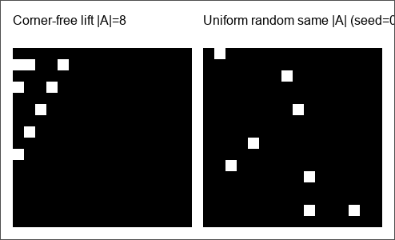
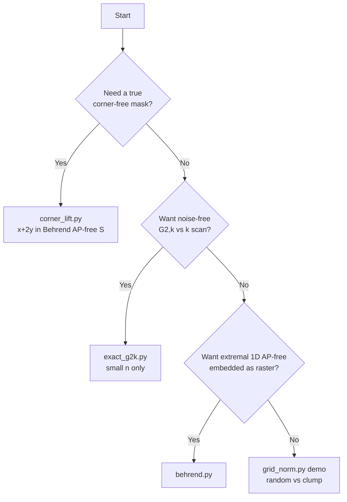
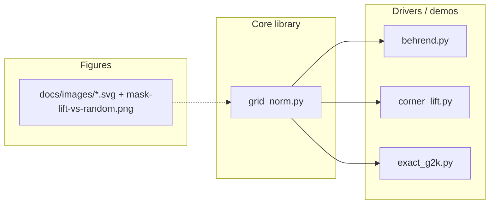
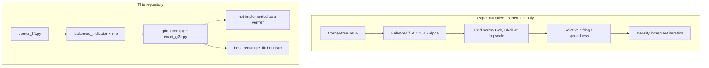

# Gowers Grid Norm “Clumpiness” Detector

[](https://arxiv.org/abs/2504.07006)

This repository is a **small, fully documented experimental lab** for the **arithmetic / Gowers grid norms** \(\|\cdot\|_{G(k,\ell)}\) on finite **2D grids** \(\Omega_1\times\Omega_2\), motivated by [Jabber–Liu–Lovett–Ostuni–Sawhney, *Quasipolynomial bounds for the corners theorem*](https://arxiv.org/abs/2504.07006) (especially **§2.2**, **Theorem 3.4–3.5**, and **Lemma 5.11**).

**What this is:** reproducible code + figures + math for teaching and sanity checks.  
**What this is not:** a proof assistant for the corners theorem.

---

## Table of contents

1. [Visual overview (figures)](#1-visual-overview-figures)
2. [Which entry point? (decision branches)](#2-which-entry-point-decision-branches)
3. [Repository layout](#3-repository-layout)
4. [Mathematical definitions](#4-mathematical-definitions)
5. [Paper mapping and research landscape](#5-paper-mapping-and-research-landscape)
6. [Corner-free lift \(x+2y\in S\) (3-AP \(\leftrightarrow\) corner)](#6-corner-free-lift-x--2y-in-s-3-ap--corner)
7. [Monte Carlo vs exact enumeration](#7-monte-carlo-vs-exact-enumeration)
8. [Heuristic density increment](#8-heuristic-density-increment)
9. [Command reference](#9-command-reference)
10. [Python API (quick index)](#10-python-api-quick-index)
11. [Presentation branches (soundbites & Q&A)](#11-presentation-branches-soundbites--qa)
12. [Limitations and honest scope](#12-limitations-and-honest-scope)
13. [Dependencies](#13-dependencies)
14. [Automated tests, CI, and release checks](#14-automated-tests-ci-and-release-checks)

---

## 1. Visual overview (figures)

Gallery order: **geometry / norms** (Figures 1–3) → **proof-side object** (4) → **computation branches** (5) → **sifting toy** (6) → **empirical masks** (7).  
See also [`docs/images/README.md`](docs/images/README.md) for a file manifest.

**Rendering note:** Figures 1–6 are **SVG** with XML declarations and plain-text labels (no fragile Unicode subscripts inside the files) so they display consistently on [GitHub](https://github.com/ab0626/Gowers-Grid-Norm-Clumpiness-Detector). Figure 7 is **PNG**.

<p align="center">
  
  <br/>
  <sub><b>Figure 1.</b> Corner \((x,y),(x+d,y),(x,y+d)\) \(\Rightarrow\) values \(z,z+d,z+2d\) for the lift \(z=x+2y\) (integer specialization).</sub>
</p>

<p align="center">
  
  <br/>
  <sub><b>Figure 2.</b> The \(K_{2,2}\) pattern behind the <b>box norm</b> \(G(2,2)\): four factors \(f(x_1,y_1)f(x_1,y_2)f(x_2,y_1)f(x_2,y_2)\).</sub>
</p>

<p align="center">
  
  <br/>
  <sub><b>Figure 3.</b> The \(K_{2,k}\) pattern for \(\|\cdot\|_{G(2,k)}\) (enumerated exactly by <code>exact_g2k.py</code> on toy grids).</sub>
</p>

<p align="center">
  
  <br/>
  <sub><b>Figure 4.</b> Balanced indicator \(f_A=\mathbf 1_A-\alpha\) (center of many proof estimates) vs raw \(\mathbf 1_A\) in demos.</sub>
</p>

<p align="center">
  
  <br/>
  <sub><b>Figure 5.</b> Two evaluation <b>branches</b>: Monte Carlo (scalable; sparse \(\alpha\) \(\Rightarrow\) noisy) vs exact (noise-free; tuple budget cap).</sub>
</p>

<p align="center">
  
  <br/>
  <sub><b>Figure 6.</b> Heuristic <code>best_rectangle_lift</code>: maximize rectangle density \(|A\cap R|/|R|\) vs global \(\alpha=|A|/|\Omega|\).</sub>
</p>

<p align="center">
  
  <br/>
  <sub><b>Figure 7.</b> <b>Corner-free lift</b> vs <b>uniform random</b> with the same \(|A|\) (regenerate locally: <code>python scripts/export_mask_heatmaps.py --n 16 --seed 0</code>).</sub>
</p>

---

## 2. Which entry point? (decision branches)



<details>
<summary><b>Branch notes (click to expand)</b></summary>

- **`grid_norm.py`**: quickest random vs artificial **clump**; good for “high vs low norm” intuition at modest density.
- **`behrend.py`**: Behrend **raster** embedding is **not** corner-free; it is a **structured sparse** control at matched \(|A|\).
- **`corner_lift.py`**: **Proven** corner-free (integer lift + integer 3-AP-free \(S\)); compare to random at same \(|A|\).
- **`exact_g2k.py`**: **Exact** \(\|\mathbf 1_A\|_{G(2,k)}\) for \(k=2,3,\ldots\) on lift vs random—no Monte Carlo variance.

</details>

---

## 3. Repository layout



| Path | Role |
|------|------|
| `grid_norm.py` | Definitions: `grid_norm`, `grid_norm_exact`, `balanced_indicator`, `best_rectangle_lift`, toy generators. |
| `behrend.py` | Behrend shell \(S\subset\{0,\ldots,M-1\}\); raster \(n\times n\) mask; random control at same \(|A|\). |
| `corner_lift.py` | Lift \(A_{x,y}=\mathbf 1\{x+2y\in S\}\); brute corner check; MC comparison vs random. |
| `exact_g2k.py` | CLI: exact \(\|\cdot\|_{G(2,k)}\) scan (tuple budget cap). |
| `docs/images/*.svg` | Static figures referenced by this README. |
| `requirements.txt` | `numpy` pin (minimal). |

---

## 4. Mathematical definitions

Let \(\Omega_1=[n]\), \(\Omega_2=[m]\) (zero-based indexing in code: `0..n-1`, `0..m-1\)). Let \(f:\Omega_1\times\Omega_2\to\mathbb R\) (code: real `float64` matrix).

### 4.1 \((k,\ell)\) Gowers grid norm (complete bipartite \(K_{k,\ell}\))

The **\((k\ell)\)-th power** is the average of the product of \(f\) over **all** edges of \(K_{k,\ell}\) with left vertices \(\{1,\ldots,k\}\) and right vertices \(\{1,\ldots,\ell\}\):

\[
\|f\|_{G(k,\ell)}^{k\ell}
\;=\;
\mathbb E_{x_1,\ldots,x_k\in\Omega_1}\;
\mathbb E_{y_1,\ldots,y_\ell\in\Omega_2}
\left[
\prod_{i=1}^{k}\prod_{j=1}^{\ell} f(x_i,y_j)
\right].
\]

The **norm** is the nonnegative root (for nonnegative \(f\), the inner average is \(\ge 0\)):

\[
\boxed{\;\|f\|_{G(k,\ell)} \;=\; \Big(\mathbb E\big[\prod_{i,j} f(x_i,y_j)\big]\Big)^{1/(k\ell)}\;}
\]

**Special case (box norm):** \(k=\ell=2\) gives the classical **\(G(2,2)\)** / **box** pattern in Figure 2.

### 4.2 The \(G(2,k)\) family (used in `exact_g2k.py`)

Equivalently, this is \(\|f\|_{G(k,\ell)}\) with **\(k_{\text{left}}=2\)** and **\(\ell=k\)** in our `grid_norm(f, k_left, ell)` convention:

\[
\|f\|_{G(2,k)}^{2k}
\;=\;
\mathbb E_{x_1,x_2\in\Omega_1}\;
\mathbb E_{y_1,\ldots,y_k\in\Omega_2}
\left[
\prod_{j=1}^{k} f(x_1,y_j)\,f(x_2,y_j)
\right].
\]

This matches the paper’s **\(\|\cdot\|_{G(2,p)}\)**-type quantities (e.g. Lemma 5.11, Theorem 3.5) up to notation for \(p\leftrightarrow k\).

### 4.3 Tuple count and exact feasibility

Independent uniform draws give:

\[
\boxed{\;\#\text{tuples for }G(k,\ell) \;=\; |\Omega_1|^{k}\,|\Omega_2|^{\ell} \;=\; n^{k} m^{\ell}\;}
\]

Exact enumeration cost is \(\Theta(n^{k} m^{\ell})\) **times** \(\Theta(k\ell)\) to multiply one product (treated as constant in Big-O summaries).

### 4.4 Balanced indicator

For a set \(A\subseteq \Omega_1\times\Omega_2\), writing \(\alpha = |A|/|\Omega_1\times\Omega_2|\),

\[
f_A(x,y) \;=\; \mathbf 1_A(x,y) - \alpha,
\qquad
\mathbb E[f_A]=0.
\]

Many proof steps control **\(f_A\)** (signed); our Monte Carlo demos sometimes use an affine **clip** to \([0,1]\) for numerical stability—see `balanced_nonneg_clip` in `grid_norm.py`.

---

## 5. Paper mapping and research landscape

| Code component | Paper concept | Purpose |
|----------------|---------------|---------|
| `lift_mask_x_plus_2y` | Projection / AP–corner equivalence (§1–2) | Turn a **1D** 3-AP-free \(S\) into a **2D** corner-free \(A\) via \(x+2y\in S\). |
| `behrend_indices` | Behrend-type extremal AP-free sets | Build explicit **3-AP-free** \(S\subset\mathbb Z\) for the lift. |
| `corner_free_lift_from_behrend` | Packaged lift demo | **Proven** corner-free \(n\times n\) mask from Behrend \(S\subset\{0,\ldots,3n-3\}\). |
| `compare_corner_free_lift_vs_random` | Lemma 5.11 / multilinear statistics | Same \(|A|\): compare \(\|\mathbf 1_A\|_{G(k,\ell)}\) on lift vs uniform random (**statistic only**). |
| `behrend_matrix` | Extremal AP-free density (§1 spirit) | Structured **non**–corner-free raster control at matched \(|A|\). |
| `grid_norm` | Lemma 5.11 family | Same \(K_{k,\ell}\) multilinear average on any mask. |
| `best_rectangle_lift` | Theorem 3.4 (sifting) | Heuristic dense sub-rectangle / “zoom-in” toy. |
| `n_samples`, `force_g22`, `suggested_grid_size_from_density` | Relative sifting; \(k\approx\log(1/\alpha)\) | Mitigate sparse-MC pathology; paper-scale \(k\) suggestions. |
| `exact_g2k.py`, `grid_norm_exact` | Exact \(\|\cdot\|_{G(2,k)}\) at toy scales | **Microscope:** no sampling noise. |

**Logarithmic scale in code:** `suggested_grid_size_from_density(alpha)` returns

\[
k \;=\; \max\!\left(2,\;\left\lceil \ln\frac{1}{\alpha}\right\rceil\right)
\]

(natural log), matching recurring **\(\log(1/\alpha)\)** discussions (cf. Lemma 5.11’s \(p=\Omega(\log(1/(\alpha\delta_D))/\varepsilon^4)\) type choices).

### 5.1 Proof arc vs. what this repo implements (branch diagram)



<details>
<summary><b>How to read the branch diagram</b></summary>

The **left branch** is the true proof pipeline in arXiv:2504.07006 (highly compressed). The **right branch** lists the closest **code hooks**: we can generate **corner-free** toy data, form **balanced** functions, measure **grid norms** exactly or approximately, and run a **rectangle search** toy. What we **do not** ship is a faithful implementation of **relative sifting** or the full **density increment machine**—those require the paper’s full graph of lemmas.

</details>

---

## 6. Corner-free lift \(x+2y\in S\) (3-AP \(\leftrightarrow\) corner)

**Definition (integer grid, no modular wrap in the default build).** Fix \(n\). Let \(S\subset\{0,1,\ldots,3n-3\}\). Define

\[
A \;=\; \{(x,y)\in\{0,\ldots,n-1\}^2 : x+2y \in S\}.
\]

**Lemma (standard).** If \(S\) contains **no** nontrivial **3-term arithmetic progression** \(z,z+d,z+2d\) with \(d\neq 0\), then \(A\) has **no corner** \(\{(x,y),(x+d,y),(x,y+d)\}\) with \(d\neq 0\) **as long as** the three grid points lie in the domain and the three mapped values lie in \(\mathbb Z\) without modular identification (our default uses small integer ranges to enforce this).

**Proof sketch (one line).** A corner would give

\[
z=x+2y,\quad z+d=(x+d)+2y,\quad z+2d=x+2(y+d),
\]

a 3-AP in \(S\). ∎

The implementation chooses \(S\) from `behrend_indices(3n-2)` (integer AP-free shell construction). See **Figure 1**.

---

## 7. Monte Carlo vs exact enumeration

| Mode | Function / script | Pros | Cons |
|------|---------------------|------|------|
| Monte Carlo | `grid_norm(..., method="mc", n_samples=…)` | Large \(n,k,\ell\) | Sparse \(\alpha\): \(\prod_{i,j}A_{x_i,y_j}\) is often \(0\) \(\Rightarrow\) high variance |
| Exact | `grid_norm_exact(f,k,ell,max_tuples=…)` | **Zero** sampling noise | Hard cap: refuses if \(n^k m^\ell >\) `max_tuples` |

See **Figure 5**.

---

## 8. Heuristic density increment

`best_rectangle_lift(mask)` maximizes **rectangle density** \(|A\cap R|/|R|\) over axis-aligned \(R\), and reports **lift** \((|A\cap R|/|R|)/\alpha\) vs global \(\alpha=|A|/|\Omega|\). See **Figure 6**.

This is **not** Theorem 3.4’s full sifting theorem (no combinatorial spreadness hypotheses, no witness functions \(g_1,g_2\) construction)—it is a **visual / exploratory** analogue.

---

## 9. Command reference

```bash
pip install -r requirements.txt

python grid_norm.py
python behrend.py
python corner_lift.py
python exact_g2k.py --n 8 --seed 0 --max-tuples 25000000 --k-cap 8
```

<details>
<summary><b><code>exact_g2k.py</code> flags</b></summary>

| Flag | Meaning |
|------|---------|
| `--n` | Grid side length \(n\) for \(n\times n\) masks (keep small). |
| `--seed` | RNG seed for the **random** control mask. |
| `--max-tuples` | Safety cap on \(n^{2+k}\) enumeration for \(G(2,k)\). |
| `--k-cap` | Largest \(k\) attempted (subject to cap). |

</details>

---

## 10. Python API (quick index)

<details>
<summary><b>Expand: core symbols in <code>grid_norm.py</code></b></summary>

| Symbol | Meaning |
|--------|---------|
| `grid_norm(f,k,l,...)` | \(\|f\|_{G(k,\ell)}\) (MC or exact via `method`) |
| `grid_norm_power_kl` | \(\|f\|_{G(k,\ell)}^{k\ell}\) before taking root |
| `grid_norm_exact(f,k,l,max_tuples=…)` | exact \(\|f\|_{G(k,\ell)}\) with refusal guard |
| `exact_grid_norm_tuple_count(n,m,k,l)` | \(n^k m^\ell\) |
| `suggested_grid_size_from_density(alpha)` | \(\lceil\ln(1/\alpha)\rceil\) (clamped \(\ge 2\)) |
| `balanced_indicator(mask)` | \(\mathbf 1_A-\alpha\) |
| `balanced_nonneg_clip` | affine re-map to \([0,1]\) for MC demos |
| `best_rectangle_lift(mask)` | best rectangle lift heuristic |
| `random_binary_matrix`, `clumped_matrix` | toy generators |

</details>

<details>
<summary><b>Expand: <code>behrend.py</code> / <code>corner_lift.py</code></b></summary>

| Symbol | Meaning |
|--------|---------|
| `behrend_indices(M)` | Behrend shell in \(\{0,\ldots,M-1\}\) |
| `behrend_matrix(n)` | raster embedding into \(n\times n\) |
| `random_mask_same_density(shape,count,rng)` | uniform fixed-size random set |
| `lift_mask_x_plus_2y(n,S)` | lift mask |
| `corner_free_lift_from_behrend(n)` | packaged corner-free lift |
| `has_corner_in_grid(mask)` | brute corner detector (square masks) |
| `compare_corner_free_lift_vs_random(...)` | MC comparison vs random |

</details>

---

## 11. Presentation branches (soundbites & Q&A)

<details>
<summary><b>Soundbite: what does the code “prove”?</b></summary>

> The code does **not** prove the corners theorem. It implements the **multilinear counting statistics** (grid norms) that Lemma 5.11 and the surrounding argument use as **signals** before density increments.

</details>

<details>
<summary><b>Q&amp;A: why use <code>G(2,2)</code> in some demos?</b></summary>

> The **box norm** \(G(2,2)\) is the smallest complete-bipartite pattern beyond bilinear averaging; it is the standard “first obstruction” scale. The full quasipolynomial proof uses **higher** parameters \(G(2,p)\) with \(p\asymp \log(1/\alpha)\) (and related objects), not a single fixed \((2,2)\) statistic alone.

</details>

<details>
<summary><b>Branch: quantitative claims (avoid overstatement)</b></summary>

The paper’s headline is **quasipolynomial** upper bounds for **corner-free** sets in \(G\times G\). That quantitative storyline is **not the same** as Behrend’s classical **1D** AP lower bound machinery—both live under “structure vs randomness”, but the constants and targets differ.

</details>

---

## 12. Limitations and honest scope

- **Sparse corner-free \(\not\Rightarrow\) large \(G(2,2)\) vs random:** at low density, a **single** norm can fail to separate lift from Bernoulli noise; this matches why the proof introduces **higher** \(G(2,k)\) and **relative sifting**.
- **Exact enumeration:** feasible only for **toy** \((n,k,\ell)\); always watch `max_tuples`.
- **Modular / group subtleties:** the packaged lift uses **integer** ranges to align corners with genuine **integer** 3-APs. Adapting to general finite abelian groups needs separate group-specific checks.

---

## 13. Dependencies

```text
numpy>=1.20
```

Install:

```bash
pip install -r requirements.txt
```

---

## 14. Automated tests, CI, and release checks

### 14.1 Pytest

From the repository root:

```bash
pip install -r requirements-dev.txt
python scripts/run_tests.py
```

`python scripts/run_tests.py` sets `PYTEST_DISABLE_PLUGIN_AUTOLOAD=1` before importing pytest, which avoids broken **globally autoloaded** third-party plugins on some machines. If your environment is clean, `python -m pytest` also works.

Configuration lives in `pytest.ini` (`pythonpath = .` so `import grid_norm` works without installing a package).

`tests/test_readme_assets.py` asserts every `docs/images/...` reference in this README exists on disk (including **Figure 7**’s PNG after you run the exporter).

### 14.2 PNG heatmaps (optional)

Requires **Pillow** (included in `requirements-dev.txt`). The exporter uses **Pillow only** (no matplotlib) so it stays compatible with **NumPy 2.x** on typical installs.

```bash
python scripts/export_mask_heatmaps.py --n 16 --seed 0
```

Default output: `docs/images/mask-lift-vs-random.png` (also shown as **Figure 7** in [§1](#1-visual-overview-figures)). Commit that PNG after generating so clones render the gallery without rerunning the script.

### 14.3 One-shot local verification

```bash
python scripts/verify_lab.py
```

Runs the four demos, regenerates **Figure 7**, then `scripts/run_tests.py -v`.

### 14.4 GitHub Actions

On push/PR to `main` or `master`, [`.github/workflows/ci.yml`](.github/workflows/ci.yml) installs `requirements-dev.txt`, runs the full test suite, smoke-runs the demos, and rebuilds `docs/images/mask-lift-vs-random.png` in CI so asset checks stay green.
